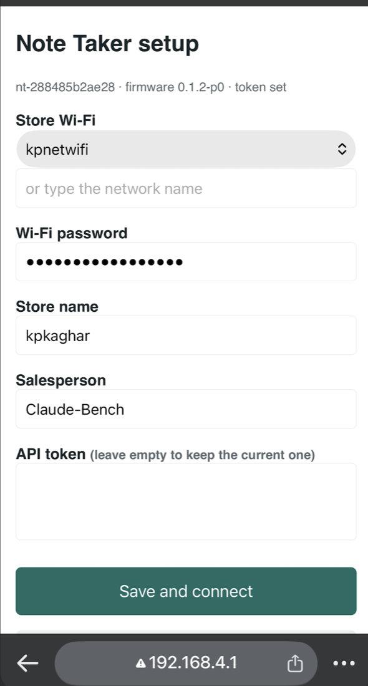
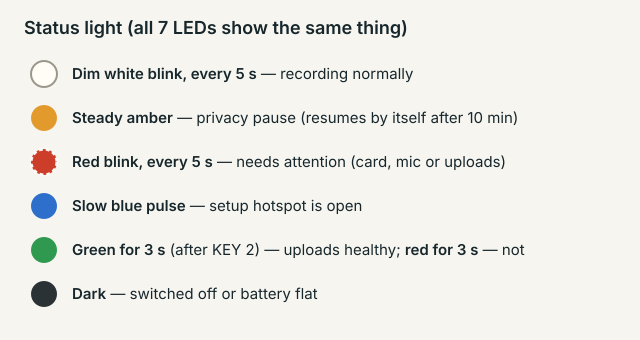

# Note Taker P0 field guide

Flash a board, connect it to a store's Wi-Fi from your phone, and check that recordings reach Smaarthi. About ten minutes per device.

| Firmware | Board | Audio | Uploads |
| --- | --- | --- | --- |
| 0.1.1-p0 | Waveshare ESP32-S3-AUDIO-Board | Opus 24 kbps, 10-minute files | Every 15 minutes |

## Before you start

- **The board:** microSD card (16 GB or more) inserted, battery connected, and a USB-C **data** cable.
- **Store Wi-Fi:** a 2.4 GHz network with a password. 5 GHz-only networks and guest Wi-Fi with an "accept terms" page won't work.
- **P0 API token:** a long text starting `eyJ`. Get it privately from the project lead, never by chat or email.
- **Setup code:** the hotspot password for every P0 device is `notetaker-p0`.

## 1. Flash the board

Download `notetaker-p0-0.1.1-full.bin` from the release [v0.1.1-p0](https://github.com/K-ran/AiNoteTaker/releases/tag/v0.1.1-p0).

1. Plug the board in with a USB-C data cable.
2. In Chrome or Edge, open **https://espressif.github.io/esptool-js/** and press **Connect**. Pick the port named like `cu.usbmodem…` (Mac) or `COM5` (Windows).
3. Press **Erase Flash** and wait for it to finish.
4. Set **Flash Address** to `0x0`, choose the `-full.bin` file, and press **Program**. It takes about 30 seconds.
5. Press the board's **RESET** button. A dim white blink every 5 seconds means it is recording.

Prefer the command line?

```sh
esptool.py --chip esp32s3 -p PORT erase_flash
esptool.py --chip esp32s3 -p PORT -b 460800 write_flash 0x0 notetaker-p0-0.1.1-full.bin
```

Updating a board that already runs P0? Write `notetaker-p0-0.1.1-app.bin` at `0x20000` instead; it keeps the device's Wi-Fi, names and token. More detail: [FLASHING.md](FLASHING.md).

## 2. Set it up from your phone

1. Hold **KEY 1** and **KEY 3** together for **10 seconds**, until the light pulses slowly blue. The hotspot stays open for 15 minutes.
2. On your phone, join the Wi-Fi network `NoteTaker-xxxx`. The last four characters are different on each device. The password is `notetaker-p0`. Ignore any "no internet" warning.
3. Open **http://192.168.4.1** in the phone's browser. Use http, not https.
4. Pick the store Wi-Fi (or type its name), then enter its password, the store name, the name of the person carrying the device, and the API token.
5. Press **Save and connect**. The device tests the Wi-Fi first and saves nothing unless it connects. On success the hotspot closes after 30 seconds and the white blink returns.



Afterwards, reconnect your phone to its normal Wi-Fi.

## 3. Read the status light

All seven LEDs show the same state. Uploading never changes the light.



| Light | Meaning |
| --- | --- |
| Dim white blink, every 5 s | Recording normally. Nothing to do. |
| Steady amber | Privacy pause. Press KEY 1 to resume, or wait 10 minutes. |
| Red blink, every 5 s | Needs attention: uploads stuck for 4 hours, a memory card problem, or the token was rejected. |
| Slow blue pulse | Setup hotspot is open. |
| Green for 3 s (after KEY 2) | Uploads are healthy. Red for 3 s means they are not. |
| Dark | Switched off or battery flat. Everything recorded so far is kept. |

## 4. Buttons

KEY 1 to KEY 3 are the three user buttons, not BOOT or RESET.

| Button | What it does |
| --- | --- |
| KEY 1, press | Privacy pause on or off. Resumes by itself after 10 minutes. |
| KEY 2, press | Shows upload health for 3 seconds: green or red. |
| KEY 1 + KEY 3, hold 10 s | Opens the setup hotspot to change Wi-Fi, names or token. |

## 5. Daily use

- **Nothing to start.** The device records whenever it's on. Wi-Fi switches on only to upload, every 15 minutes, to save battery.
- **Charge** it at the end of each shift.
- **If the store changes its Wi-Fi password**, repeat step 2. Recordings wait on the card in the meantime, so nothing is lost.

## 6. Check the recordings

Each 10-minute file becomes a conversation in Smaarthi, named so you can tell where it came from:

```
nt-288485b2ae28_Indiranagar_Priya_00000140_20261003T162355Z.ogg
device id       store       person seq      start time (UTC)
```

Files are deleted from the device only after Smaarthi has them.

## Troubleshooting

| What you see | Likely cause | What to do |
| --- | --- | --- |
| Flashing says "No serial data received" | Board not in download mode, or a charge-only cable | Replug the cable. If it still fails: hold BOOT, tap RESET, release BOOT, then flash again. |
| No `NoteTaker-xxxx` network | Hotspot not open | Hold KEY 1 + KEY 3 for the full 10 seconds until the light pulses blue. |
| The page at 192.168.4.1 won't load | Phone switched back to its normal Wi-Fi | Rejoin `NoteTaker-xxxx` and open the address with http. |
| "Could not connect" | Wrong password, 5 GHz-only network, or a sign-in page | Use the staff 2.4 GHz network and try again. |
| Red blink every 5 s | Uploads stuck, card problem, or token rejected | Redo setup with the right Wi-Fi and token, and check the card is seated. |

## Known limits of P0

- **Audio links are public.** Anyone with a recording's link can play it until the backend makes storage private. Keep links inside the team.
- **One shared token** on every P0 device. Report a lost device to the project lead the same day so the token can be rotated.
- **The memory card is not encrypted yet.** That comes in P1.
- **No remote monitoring or over-the-air updates yet** (P1). Updates are done over USB.
- **One conversation per 10-minute file.** Joining them into real conversations comes in P2.
- **Battery level isn't measured** on this board revision.
