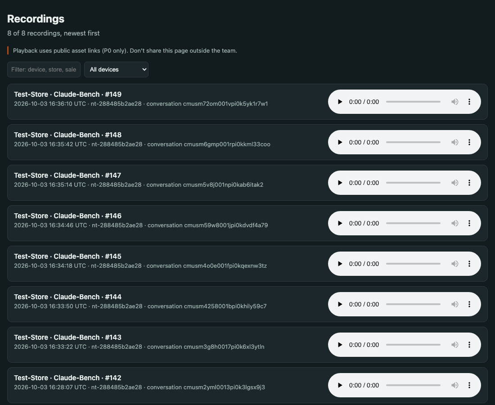

# Note Taker P0: setup and daily use

The device records conversations all day, saves them to its memory card, and uploads them to Smaarthi every 15 minutes over Wi-Fi. Each upload becomes a conversation in Smaarthi. Files are deleted from the card only after Smaarthi has them.

This is the **P0 pilot** build: a developer build on the prototype board. Read "Known limits" before handing a device to a store.

## What you need

- A board flashed with firmware 0.1.0-p0 ([flashing guide](FLASHING.md)), with a microSD card (16 GB or more) inserted and the battery connected.
- A phone.
- The store's **2.4 GHz** Wi-Fi name and password. 5 GHz-only networks and guest Wi-Fi with an "accept terms" page don't work.
- The **P0 API token** (a long text starting `eyJ…`). Ask the project lead; it is shared privately, never in chat or email.
- The developer setup code: **`notetaker-p0`**.

## 1. Switch on

Turn the board on. Within a few seconds the light starts a **dim white blink every 5 seconds**: it is recording. It records even before it has Wi-Fi, and keeps the audio until it can upload.


## 2. Open the setup hotspot

Hold **KEY 1 and KEY 3 together for 10 seconds**. KEY 1–3 are the three user buttons, not BOOT or RESET. The light changes to a **slow blue pulse**. The hotspot stays open for 15 minutes.

## 3. Connect your phone

1. On your phone, open Wi-Fi settings and join **`NoteTaker-xxxx`**. The last four characters are unique to each device. The password is **`notetaker-p0`**.
2. Your phone may warn "no internet". That's expected; stay connected.
3. Open a browser and go to **http://192.168.4.1**.

## 4. Fill in the form


| Field | What to enter |
| --- | --- |
| Store Wi-Fi | Pick the network, or type its name in the box below |
| Wi-Fi password | The store Wi-Fi password |
| Store name | e.g. `Indiranagar` (letters, numbers and dashes work best) |
| Salesperson | Who carries this device, e.g. `Priya` |
| API token | Paste the P0 token. Leave it empty to keep the current one |

Press **Save and connect**. The device tests the Wi-Fi first and **saves only if the connection works**. You'll see either:

- *"Connected to … Setup done"*: the hotspot closes after 30 seconds, and the light goes back to the white blink.
- *"Could not connect"*: check the network name and password, then press Save again.

Reconnect your phone to its normal Wi-Fi.

## 5. Daily use

- **Nothing to start.** The device records whenever it's on. It uploads every 15 minutes, with Wi-Fi switched off in between to save battery.
- **Privacy pause:** press **KEY 1** once. The light turns **steady amber**. Press again to resume; it also resumes by itself after 10 minutes.
- **Status check:** press **KEY 2**. The light shows **green for 3 seconds** if uploads are healthy, **red** if not.
- **Charge** it at the end of each shift.
- **Wi-Fi password changed?** Repeat steps 2 to 4. No audio is lost in the meantime: it waits on the card.

## Viewing recordings (team)

Each upload appears in Smaarthi as a conversation, with a file name like:

```
nt-288485b2ae28_Indiranagar_Priya_00000140_20261003T162355Z.ogg
device id       store       person  seq      start time (UTC)
```

For a quick listen, the repo includes a local viewer:

```sh
python3 tools/recordings_viewer.py --events "/Volumes/NO NAME/LOG/EVENTS.LOG"   # from the device's SD card
python3 tools/recordings_viewer.py --serial /dev/cu.usbmodem1101                # live, device plugged in
# then open http://localhost:8080
```



## Troubleshooting

| What you see | What it means | What to do |
| --- | --- | --- |
| Red blink every 5 s | Uploads stuck for 4 h, memory card problem, or token rejected | Check Wi-Fi and token (redo setup). Check the card is seated. |
| No `NoteTaker-xxxx` network | Hotspot not open | Hold KEY 1 + KEY 3 for a full 10 s until the light pulses blue |
| Page doesn't load | Phone switched back to its normal Wi-Fi | Rejoin `NoteTaker-xxxx`, then open `http://192.168.4.1` (http, not https) |
| "Could not connect" | Wrong password, 5 GHz-only network, or a sign-in page | Use the staff 2.4 GHz network |
| Light dark | Off or battery flat | Charge. The device keeps everything recorded so far. |

## Known limits of P0

- **Audio links are public.** Anyone who has a recording's link can play it, until the backend makes storage private. Treat links as confidential.
- **One shared login token** on every P0 device. If a device is lost, tell the project lead the same day so the token can be rotated.
- **The memory card is not encrypted yet** (P1).
- **No remote monitoring or remote updates yet** (P1). Updates are done over USB.
- **One conversation per 10-minute file**: conversations are not stitched yet (P2).
- **Battery level isn't measured** on this board revision.
